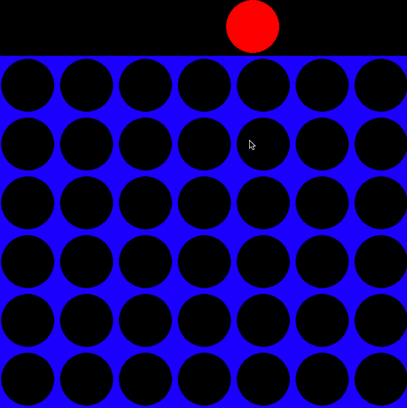

# connect4

To play:
python connect4.py

This is a copy of the popular game connect4. Play against a difficult computer.

* AI Bot uses the minimax algorithm to choose the best move. And incorporates alpha beta pruning to reach lower depths of checking while keeping game optimal to play.

## Features
•   Established a scoring method used generally for rule-based games, that allows the AI to compute 
     scores for moves made by the player and itself.  
•   Implemented the minimax algorithm so AI can recursively find the most optimal move through
     minimax branches. Minimax algorithm was optimized with alpha beta pruning.   
•   Used pygame to render the connect-4 images on screen, and handle game functionality.   

